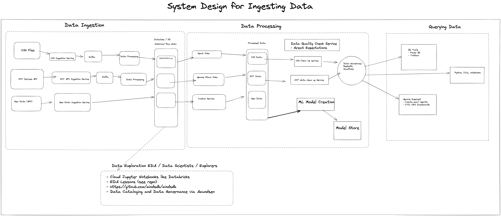
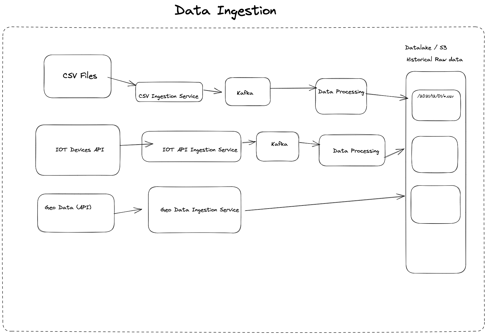
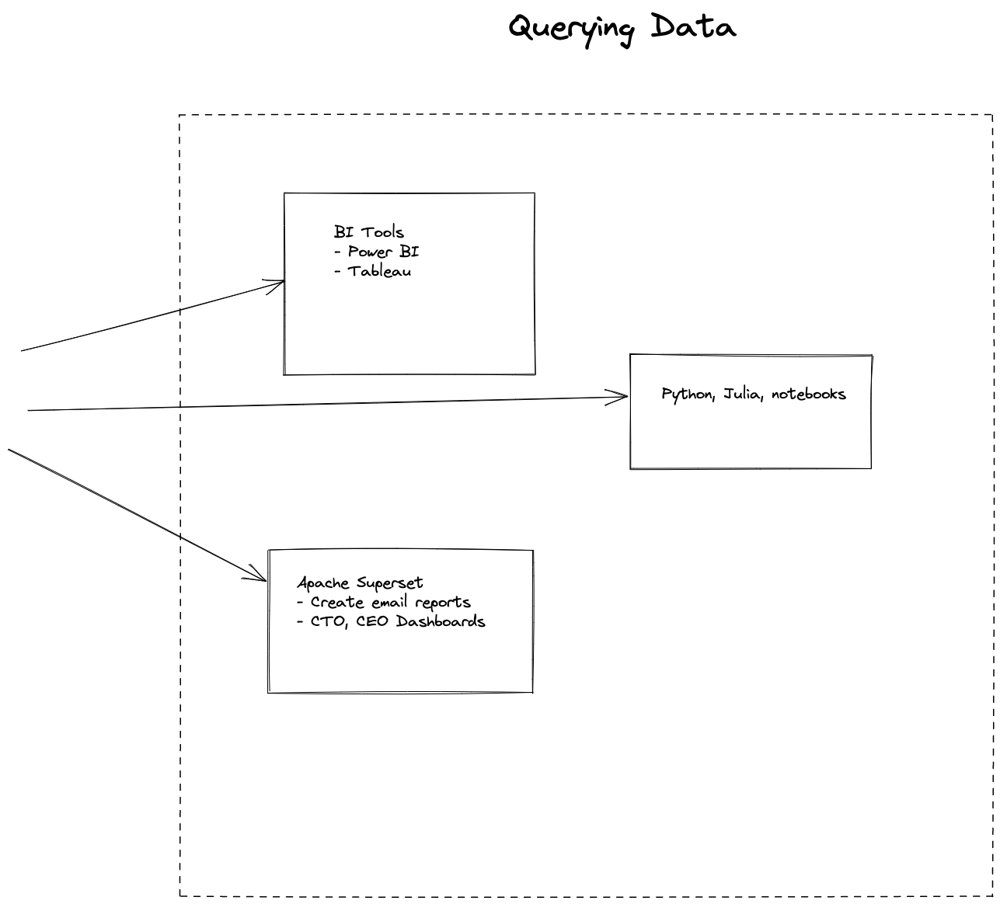

# System Design 

## Functional Requirements

- IoT sensor timeseries data that emits new datapoints every 5 seconds, which can be fetched via API by providing a start and end timestamp. We collect from 50 different API feeds, and a datapoint in a feed is ~200 bytes.
- 100 different data sources in CSV format, published daily at different times (one example of this is the New York load data as mentioned above). Each CSV typically has 5 minute interval timeseries data, and is ~100kb in size.
- ~20 gigabytes of geospatial weather data fetched, per day. This is made available in 100 chunks of 50mb every 6 hours. **Note:** you don’t need to worry about the details of processing and querying geospatial data for the purposes of this problem; we just need to fetch it.

## Nonfunctional

- We’d like the system to be able to handle fetching from data sources that are sometimes flaky or are intermittently down, without needing manual intervention. For example, New York load data may sporadically go down for a few hours every month.
- Be able to process and make IoT/CSV data available within 2 minutes of it being published

# High Level 

# Detailed System Design Overview 

Our system design is organized into four well-defined, modular components.

1. **Data Ingestion**: This component is responsible for collecting data from a range of sources. It is designed to effectively handle network partitions and cope with unstable sources, ensuring a steady flow of data into the system.

2. **Data Processing**: This section focuses on the sanitization and normalization of data. It involves cleaning up inconsistencies, errors, or any irrelevant information, thereby preparing the data for efficient analysis and use.

3. **Data Querying**: This component incorporates a set of sophisticated tools aimed at presenting data to various stakeholders. It facilitates easy retrieval and presentation of data, allowing users to gain insight into specific aspects of the data as needed.

4. **Data Exploration (EDA)**: Primarily targeted at data-savvy engineers, this  provides mechanisms for in-depth data exploration. It facilitates the understanding of data characteristics and patterns, enabling users to draw meaningful insights from the data at hand.

[Excalidraw Link of Topology](https://excalidraw.com/#json=vfTTN5wxmJ4C7owaU0-B-,bfNLGvUbFTTfvU6y_SIWtA)

## Data Ingestion

The data ingestion phase is a crucial one as it sets the stage for how effectively we can extract insights from our data. We approach this by using a first-principled approach that accommodates different types of data.

To handle this diverse array of data types, we will establish multiple pipelines, each optimized for a particular kind of data. 

1. **CSV Files**: The handling of CSV files can be approached with classical methods from log analysis. We can create an ingestion pipeline that reads CSV files, parses the data into a usable format, and then loads it into our data storage system. The pipeline will be designed to handle large files and will include error-checking mechanisms to ensure the integrity of the data.

2. **IoT Devices**: Data from IoT devices typically arrive in small payloads, sent periodically. This is similar to metric collections in systems monitoring. To ingest this data, we can set up an API-based pipeline. This pipeline would regularly make API calls to IoT devices or endpoints, collect the small data payloads, and then store them for further processing. The pipeline would also have robust error handling to account for potential network issues or device failures.

3. **Geo Data**: Geographic data can often be unstructured, meaning it doesn't fit neatly into a table or other simple data structure. This data can include things like GPS coordinates, map data, or other location-based information. To handle this, we will develop a specialized pipeline capable of parsing and structuring this data. This may involve the use of specific libraries or tools designed for handling geo data. The pipeline would then load this structured data into our system, where it can be queried and analyzed alongside other data.

**Implementation Details/Heuristics** 

Here is a suggested workflow to handle a new set of data sources:

1. **Data Extraction**: Start by extracting data from a few sources to familiarize yourself with their characteristics and peculiarities. A few years ago, I was working on figuring out if covid had an impact on high school students. The first step was to exact all NCES.ed.gov test data with a few scripts, here is how I did it: 
https://github.com/apaniagua6/ncesdata

2. **Exploratory Scripts**: Use quick Python scripts in Jupyter notebooks for exploratory data analysis. This will help you better understand the data and identify potential issues. EDA (Explarotary Data Analysis) is a tool you should add to your arsenal to get a feel for what type of data processing you will be doing. I created a sample EDA for NOAS weather data in the following directory [https://github.com/melatonin355/ingesting-data-system-design/blob/main/eda-csv/EDA-load-NYC.ipynb](https://github.com/melatonin355/ingesting-data-system-design/blob/main/eda-csv/EDA-load-NYC.ipynb) 

3. **Addressing Extraction Nuances**: After gaining insights into the data extraction process and identifying potential challenges, work on strategies to navigate these issues.

4. **Handling API Challenges**: Be prepared for situations where APIs may be unreliable or fragmented. For example, data from 1986 - 2000 might be in one format, and data from 2000 - 2017 might be in another. Approach these challenges with patience and systematic problem-solving. Aim to present your findings in a digestible manner, such that the next person can replicate your work in a fraction of the time.

5. **Productionizing an MVP**: Once you have a solid understanding of the data and its challenges, start developing a Minimum Viable Product (MVP). Use tools like Python, Spark, Airflow, and Lambda functions to build this initial version of the data pipeline.

6. **Creating Libraries**: As the pipeline becomes more mature, start abstracting common tasks into libraries. This will make the pipeline easier to maintain and enable others to leverage your work more effectively.

# Process Data

In the data processing phase, different strategies/pipelines are used depending on the type of data we are dealing with.

**CSV Files**: We can leverage the power of Apache Spark and Apache Hudi for CSV files. Apache Spark offers scalable data processing, while Apache Hudi provides a structured way to manage our data, including defining a schema. These tools will be instrumental in cleaning up and structuring the CSV data for further analysis.

**IoT Device Data**: Apache Storm is an excellent choice for handling IoT device data. It's a real-time computation system that can quickly ingest and process data, making it ideal for dealing with the constant stream of small payloads from IoT devices. We will use Apache Storm not only to ingest the data but also to perform preliminary cleanup and normalization.

**Geo Data**: Given its typically unstructured nature, we initially treat Geo data as binary data. This approach allows us to manage and store the data without a predefined schema. In the meantime, we encourage subject matter experts (SMEs) with an interest in geographic data to explore and develop domain expertise in handling this type of data. This will ensure that when we are ready to fully incorporate Geo data into our data processing and analysis, we have the necessary knowledge and skills to do it effectively.

# Querying Data

Recognize that multiple teams will need to query the data for diverse purposes. Identify these purposes and ensure each relevant function has access to this data.

**Apache Superset**: This is an excellent open-source software that enables the creation of visually appealing dashboards. It's a powerful tool for data visualization and exploration.

**PowerBI**: If we have invested in a business intelligence tool like PowerBI, it's a good idea to utilize it now. PowerBI offers robust data analysis capabilities, and can generate interactive reports and dashboards, providing an intuitive way for teams to interact with the data.

**SQL Clients**: Providing the option to query data via SQL clients is always beneficial. This allows more technically inclined team members to directly interact with the data, providing them with the flexibility to construct complex queries and perform in-depth data analysis.

When a company provides access to a dataset via SQL clients, several issues can potentially arise, especially in the areas of data governance and security. These issues may include:

1. **Data Privacy and Compliance:** Ensuring compliance with data privacy regulations like GDPR, CCPA, HIPAA, etc., can be a significant challenge. It's necessary to control who can access certain types of data and to what extent they can do so.

2. **Access Control:** Properly managing permissions and access controls can be complex. Not all users should have the same level of access to all data. For example, sensitive information should be only accessible to authorized individuals.

3. **Data Leakage:** There's always a risk of data leakage or loss, especially if many people have access to the data. This can occur due to malicious intent, negligence, or simple human error.

4. **Data Integrity:** If users have write access, there's a risk of unintentional or intentional data corruption. Data validation and monitoring are required to maintain data integrity.

5. **Auditing and Tracking:** Keeping track of who is accessing what data, when, and why, can be a significant challenge. This is important not only for security but also for understanding how data is being used within the organization.

6. **Performance Issues:** If many users are querying large datasets at the same time, it can lead to performance issues. This can be mitigated by implementing query optimization, data partitioning, and appropriate indexing.

7. **Training and Usage:** Ensuring users understand how to use SQL clients and write efficient queries can be a challenge. Poorly written queries can consume unnecessary resources and affect overall system performance.

**Protip** It's important to enumerate your stakeholders and have them engaged in solving the above problems in an agile way. This specific area could derail the implementation and maintanance of a system since the maturity and tooling in this area is still fluid. Sometimes it's easier to have a different tool for each type of stakeholder instead of trying to find 1 ring to rule them all. 

## Machine Learning Story
ML model creation, tunning, etc is outside of the scope of this system design but this foundational system will get you very close to being able to add the following: 

1. **Data Preparation for ML**: Ensure that the data is cleaned, normalized, and appropriately structured for machine learning tasks. Depending on the specific models used, this may involve transforming categorical data into numerical data, handling missing values, and scaling or normalizing numerical data.

2. **Feature Engineering**: This is a critical step in model creation where domain knowledge is used to create features that make machine learning algorithms work. This could be as simple as creating interaction terms or as complex as creating embeddings from text data.

3. **Model Selection**: Different ML models are appropriate for different types of data and tasks. Understanding the strengths and weaknesses of various models - from linear regression to deep learning - will help in selecting the right model for the task at hand.

4. **Model Training and Validation**: Split the dataset into training, validation, and test sets. The model is trained on the training set, and its hyperparameters are tuned based on performance on the validation set. Finally, the model's performance is evaluated on the test set.

5. **Model Deployment and Monitoring**: After a model is trained and validated, it's deployed to make predictions on new data. It's important to monitor the model's performance over time to ensure it's still performing well as new data comes in.

I have seen some interesting open source technologies in each of the above areas being developed and released in the last few months so it's important to create quick MVP's when deciding on which framework/tool to use within the context of the system that is already operational. By having a raw datalake, processed datalake, and kafka this provides places to tap into the pipeline and add the above pieces. 

## Deployment

- https://domain-challenger.vercel.app/docs/deployment-mechanics
- https://domain-challenger.vercel.app/docs/deployment-ideas/versioning
- https://domain-challenger.vercel.app/docs/deployment-ideas/observability 

tldr; We can use terraform, AWS, and align on a versioning strategy. We should also wear an SRE hat and build observability into our system and aknowledge that we can automate our processess through time. 

## Further Reading 

Check out the following book if you would like to dive deeper into some theoretical concepts:

- [System Design Interview - An Insider's Guide](https://www.amazon.com/System-Design-Interview-Insiders-Guide/dp/1736049119/)
  - Chapter 5: Metrics Monitoring
  - Chapter 6: Ad Click Event Aggregation
  - Chapter 13: Stock Exchange

## Extra 

Some of my personal presentations that might be interesting:

**Preventing Opioid Thefts and Drug Diversion in Healthcare**

 

**Data Science for Education**

 

